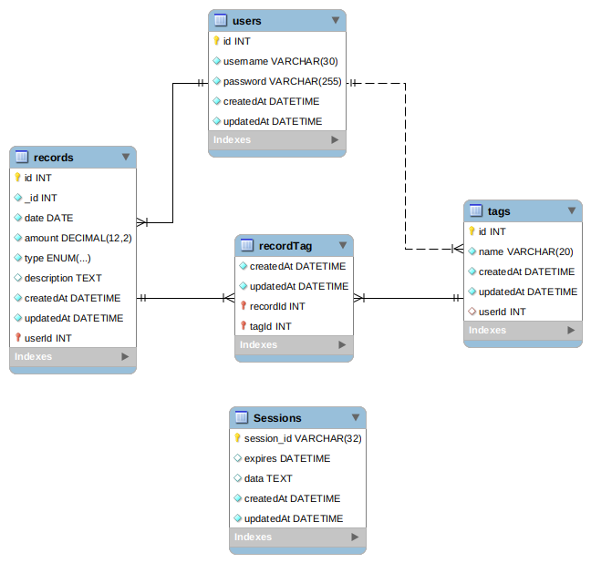
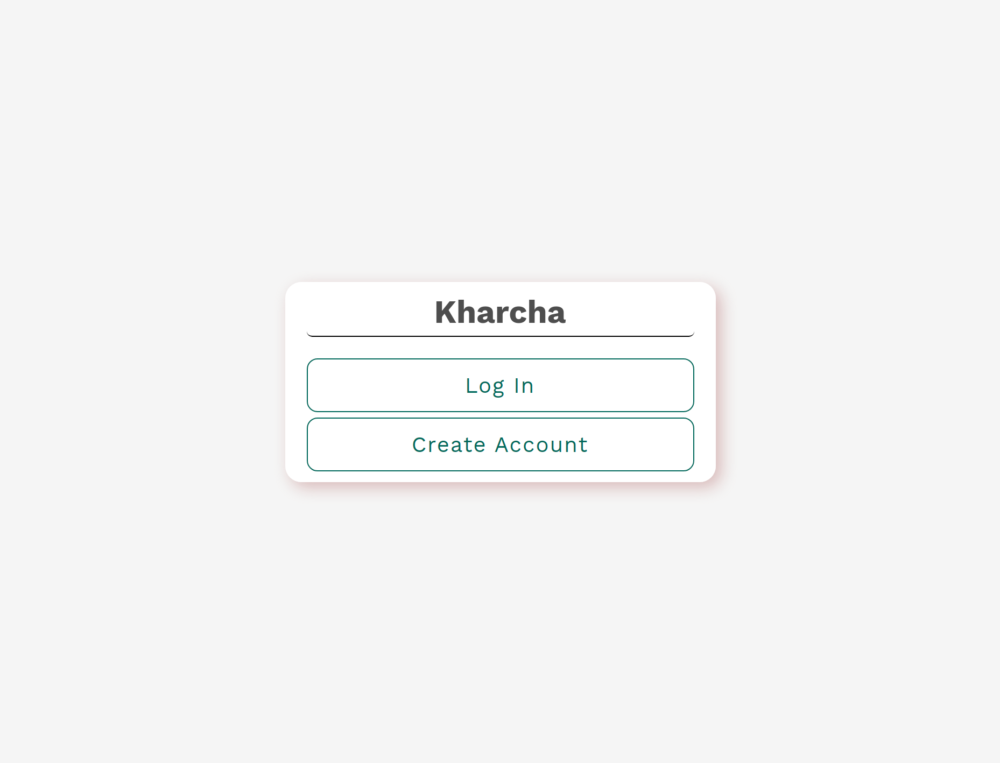
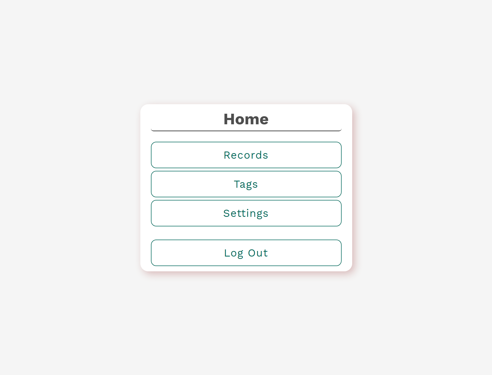
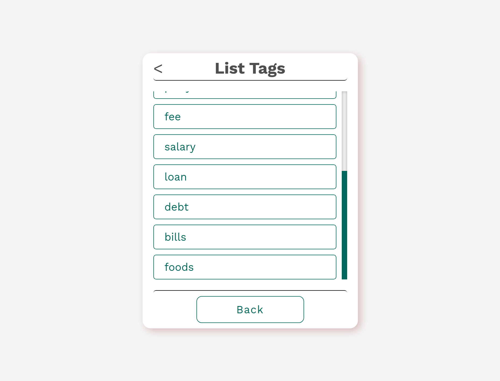
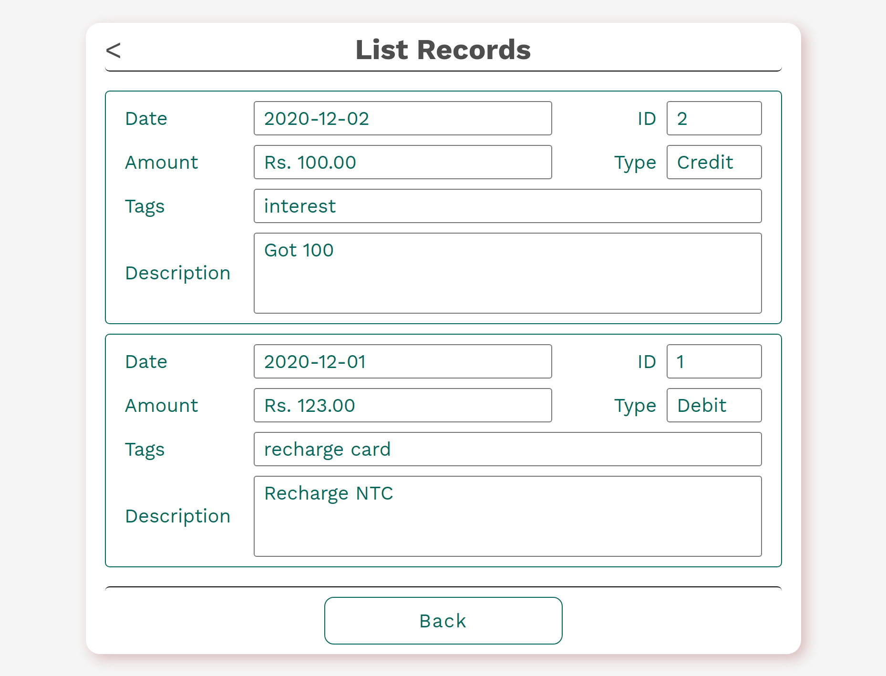
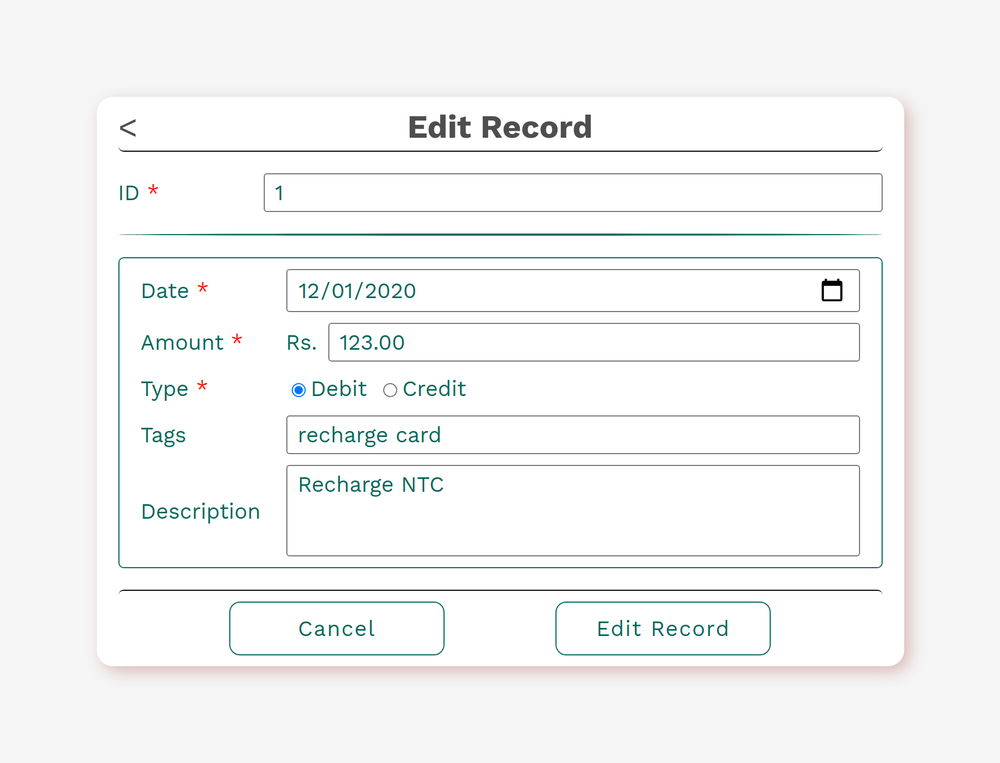
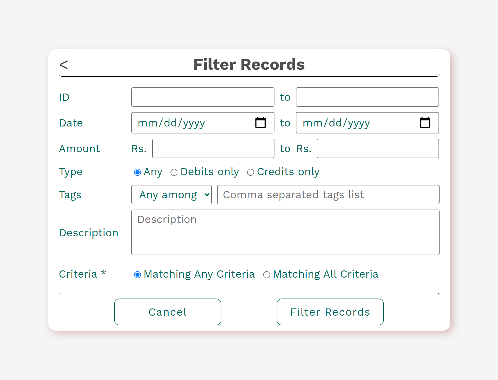

# Kharcha-Web

A simple program to keep track of daily transactions. Trying out [Kharcha](https://github.com/OjeshManandhar/Kharcha)[implemented in C] in Web. Almost similar to the implementation in C. I used MySQL DB for this, and [Sequelize](https://sequelize.org/) to make it easier for handling DB related tasks.

### Screenshots

### Installing & running

- Setup a SQL DB, no need to setup any tables, [Sequelize](https://sequelize.org/) will take care of it.
- Clone or download the repo
- Create a `.env` file in root and add the required key-value pairs with help of [.env.example](./.env.example)
- Run `yarn` to install the required dependencies and dev-dependencies
- Run `yarn start` to run up the server
